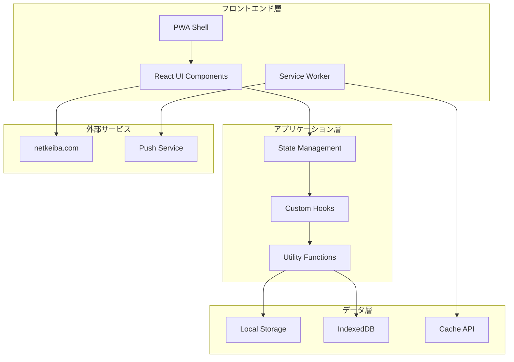

# 競馬予想＋投資管理アプリ 設計書

## 概要

既存のReact競馬予想アプリをベースに、モバイル最適化とPWA対応、将来のiOSアプリ化を見据えた設計を行う。現在のコードの優れた予想アルゴリズムとデータ管理機能を活かしながら、モバイルファーストの設計に刷新する。

## アーキテクチャ

### 全体アーキテクチャ



### 技術スタック

- **フロントエンド**: React 18 + TypeScript
- **UI フレームワーク**: Tailwind CSS + Headless UI
- **状態管理**: React Hooks (useState, useReducer, useContext)
- **データ永続化**: IndexedDB (Dexie.js) + LocalStorage
- **PWA**: Workbox + Web App Manifest
- **チャート**: Recharts
- **アイコン**: Lucide React
- **ビルドツール**: Vite
- **将来のモバイル化**: Capacitor (iOS/Android対応)

## コンポーネント設計

### 1. アプリケーション構造

```
src/
├── components/           # UIコンポーネント
│   ├── common/          # 共通コンポーネント
│   ├── race/            # レース関連
│   ├── prediction/      # 予想関連
│   ├── statistics/      # 統計関連
│   └── investment/      # 投資管理関連
├── hooks/               # カスタムフック
├── services/            # ビジネスロジック
├── utils/               # ユーティリティ
├── types/               # TypeScript型定義
├── stores/              # 状態管理
└── assets/              # 静的ファイル
```

### 2. 主要コンポーネント

#### App.tsx
```typescript
interface AppState {
  currentView: ViewType;
  theme: 'light' | 'dark';
  isOnline: boolean;
  installPrompt: BeforeInstallPromptEvent | null;
}
```

#### RaceManager
- レース作成・編集
- 馬データ入力・解析
- netkeiba データパース

#### PredictionEngine
- 予想アルゴリズム実行
- スコア計算
- ランキング生成

#### InvestmentTracker
- 投資記録管理
- 収支計算
- 統計レポート

#### StatisticsView
- 的中率分析
- トレンドグラフ
- 条件別統計

### 3. モバイル最適化コンポーネント

#### TouchOptimizedButton
```typescript
interface TouchButtonProps {
  size: 'sm' | 'md' | 'lg';
  variant: 'primary' | 'secondary' | 'danger';
  haptic?: boolean;
  children: React.ReactNode;
  onClick: () => void;
}
```

#### SwipeableCard
```typescript
interface SwipeableCardProps {
  onSwipeLeft?: () => void;
  onSwipeRight?: () => void;
  threshold?: number;
  children: React.ReactNode;
}
```

#### PullToRefresh
```typescript
interface PullToRefreshProps {
  onRefresh: () => Promise<void>;
  threshold?: number;
  children: React.ReactNode;
}
```

## データモデル

### 1. 既存データ構造の拡張

#### Race Model
```typescript
interface Race {
  id: string;
  date: string;
  venue: string;
  raceNumber: number;
  distance: number;
  surface: 'turf' | 'dirt';
  condition: 'good' | 'slightly_heavy' | 'heavy' | 'bad';
  horses: Horse[];
  // 新規追加
  grade?: 'G1' | 'G2' | 'G3' | 'Listed' | 'Open';
  prizeMoney?: number;
  weather?: string;
  createdAt: Date;
  updatedAt: Date;
}
```

#### Horse Model
```typescript
interface Horse {
  name: string;
  number: number;
  jockey: string;
  popularity: number;
  odds: number | null;
  pastRaces: PastRace[];
  // 新規追加
  age?: number;
  sex?: 'male' | 'female' | 'gelding';
  weight?: number;
  trainer?: string;
  owner?: string;
  breeding?: string;
}
```

#### Investment Model
```typescript
interface Investment {
  id: string;
  raceId: string;
  predictionId: string;
  betType: 'win' | 'place' | 'exacta' | 'quinella' | 'trifecta';
  selections: number[];
  amount: number;
  odds: number;
  payout: number;
  profit: number;
  timestamp: Date;
}
```

### 2. PWA対応データ構造

#### AppSettings
```typescript
interface AppSettings {
  theme: 'light' | 'dark' | 'auto';
  notifications: boolean;
  autoSync: boolean;
  defaultBetAmount: number;
  riskLevel: 'conservative' | 'moderate' | 'aggressive';
  predictionWeights: {
    speed: number;
    recent: number;
    odds: number;
  };
}
```

#### SyncStatus
```typescript
interface SyncStatus {
  lastSync: Date;
  pendingChanges: number;
  conflictResolution: 'local' | 'remote' | 'manual';
}
```

## インターフェース設計

### 1. データアクセス層

#### RaceRepository
```typescript
interface RaceRepository {
  create(race: Omit<Race, 'id'>): Promise<Race>;
  findById(id: string): Promise<Race | null>;
  findByDate(date: string): Promise<Race[]>;
  update(id: string, updates: Partial<Race>): Promise<Race>;
  delete(id: string): Promise<void>;
  search(criteria: RaceSearchCriteria): Promise<Race[]>;
}
```

#### PredictionRepository
```typescript
interface PredictionRepository {
  save(prediction: PredictionResult): Promise<string>;
  findByRaceId(raceId: string): Promise<PredictionResult[]>;
  getHistory(limit?: number): Promise<PredictionResult[]>;
  updateResult(id: string, result: ActualResult): Promise<void>;
}
```

#### InvestmentRepository
```typescript
interface InvestmentRepository {
  record(investment: Investment): Promise<string>;
  getByPeriod(start: Date, end: Date): Promise<Investment[]>;
  calculateStats(criteria: StatsCriteria): Promise<InvestmentStats>;
  export(format: 'csv' | 'json'): Promise<Blob>;
}
```

### 2. サービス層

#### PredictionService
```typescript
interface PredictionService {
  calculatePredictions(race: Race, weights?: PredictionWeights): PredictionResult[];
  analyzeHorse(horse: Horse, raceInfo: RaceInfo): HorseAnalysis;
  getConfidenceLevel(predictions: PredictionResult[]): ConfidenceLevel;
}
```

#### DataParsingService
```typescript
interface DataParsingService {
  parseNetkeibaData(text: string): Horse[];
  validateHorseData(horse: Horse): ValidationResult;
  extractRaceInfo(text: string): Partial<Race>;
}
```

#### SyncService
```typescript
interface SyncService {
  syncToCloud(): Promise<SyncResult>;
  syncFromCloud(): Promise<SyncResult>;
  resolveConflicts(conflicts: DataConflict[]): Promise<void>;
  getStatus(): SyncStatus;
}
```

## エラーハンドリング

### 1. エラー分類

```typescript
enum ErrorType {
  NETWORK_ERROR = 'NETWORK_ERROR',
  VALIDATION_ERROR = 'VALIDATION_ERROR',
  STORAGE_ERROR = 'STORAGE_ERROR',
  PARSING_ERROR = 'PARSING_ERROR',
  CALCULATION_ERROR = 'CALCULATION_ERROR'
}

interface AppError {
  type: ErrorType;
  message: string;
  details?: any;
  timestamp: Date;
  recoverable: boolean;
}
```

### 2. エラー処理戦略

- **ネットワークエラー**: オフラインモードへの自動切り替え
- **データ解析エラー**: 部分的なデータでの処理継続
- **計算エラー**: フォールバック値の使用
- **ストレージエラー**: 代替ストレージへの切り替え

## テスト戦略

### 1. テスト分類

#### Unit Tests
- 予想アルゴリズムの正確性
- データ解析ロジック
- 統計計算機能
- ユーティリティ関数

#### Integration Tests
- データフロー全体
- PWA機能
- オフライン同期
- パフォーマンス

#### E2E Tests
- ユーザージャーニー
- モバイル操作性
- クロスブラウザ対応

### 2. テストツール

- **Unit**: Jest + React Testing Library
- **Integration**: Cypress
- **Performance**: Lighthouse CI
- **Mobile**: BrowserStack

## パフォーマンス最適化

### 1. 初期ロード最適化

- **Code Splitting**: ルート別の動的インポート
- **Tree Shaking**: 未使用コードの除去
- **Bundle Analysis**: webpack-bundle-analyzer
- **Critical CSS**: Above-the-fold CSS の優先読み込み

### 2. ランタイム最適化

- **Virtual Scrolling**: 大量データの効率的表示
- **Memoization**: 重い計算結果のキャッシュ
- **Debouncing**: 入力イベントの最適化
- **Web Workers**: バックグラウンド処理

### 3. ストレージ最適化

- **IndexedDB**: 大容量データの効率的管理
- **Compression**: データ圧縮による容量削減
- **Cleanup**: 古いデータの自動削除
- **Indexing**: クエリパフォーマンスの向上

## セキュリティ設計

### 1. データ保護

- **暗号化**: 機密データのAES暗号化
- **ハッシュ化**: パスワード等のbcryptハッシュ化
- **サニタイゼーション**: XSS攻撃の防止
- **CSP**: Content Security Policy の実装

### 2. プライバシー保護

- **データ最小化**: 必要最小限のデータ収集
- **匿名化**: 個人識別情報の除去
- **同意管理**: ユーザー同意の適切な管理
- **データ削除**: ユーザーによるデータ完全削除

## PWA実装詳細

### 1. Service Worker

```typescript
// sw.ts
const CACHE_NAME = 'keiba-app-v1';
const STATIC_ASSETS = [
  '/',
  '/static/js/bundle.js',
  '/static/css/main.css',
  '/manifest.json'
];

self.addEventListener('install', (event) => {
  event.waitUntil(
    caches.open(CACHE_NAME)
      .then(cache => cache.addAll(STATIC_ASSETS))
  );
});

self.addEventListener('fetch', (event) => {
  event.respondWith(
    caches.match(event.request)
      .then(response => response || fetch(event.request))
  );
});
```

### 2. Web App Manifest

```json
{
  "name": "競馬予想＋投資管理アプリ",
  "short_name": "競馬予想",
  "description": "モバイル対応競馬予想・投資管理アプリ",
  "start_url": "/",
  "display": "standalone",
  "theme_color": "#2563eb",
  "background_color": "#ffffff",
  "icons": [
    {
      "src": "/icons/icon-192.png",
      "sizes": "192x192",
      "type": "image/png"
    },
    {
      "src": "/icons/icon-512.png",
      "sizes": "512x512",
      "type": "image/png"
    }
  ]
}
```

## 将来のiOS対応設計

### 1. Capacitor統合準備

```typescript
// capacitor.config.ts
import { CapacitorConfig } from '@capacitor/cli';

const config: CapacitorConfig = {
  appId: 'com.keibaapp.mobile',
  appName: '競馬予想アプリ',
  webDir: 'dist',
  bundledWebRuntime: false,
  plugins: {
    PushNotifications: {
      presentationOptions: ["badge", "sound", "alert"]
    },
    LocalNotifications: {
      smallIcon: "ic_stat_icon_config_sample",
      iconColor: "#488AFF"
    }
  }
};

export default config;
```

### 2. ネイティブ機能インターフェース

```typescript
interface NativeFeatures {
  notifications: NotificationService;
  storage: SecureStorageService;
  biometrics: BiometricService;
  sharing: SharingService;
  camera: CameraService;
}
```

## 移行戦略

### Phase 1: 基盤整備
1. 既存コードのTypeScript化
2. コンポーネント分割とモジュール化
3. 状態管理の整理
4. テスト環境構築

### Phase 2: モバイル最適化
1. レスポンシブデザイン実装
2. タッチ操作対応
3. パフォーマンス最適化
4. PWA機能実装

### Phase 3: 機能拡張
1. 投資管理機能強化
2. 統計分析機能追加
3. データ同期機能
4. オフライン対応

### Phase 4: iOS対応
1. Capacitor統合
2. iOS UI/UX調整
3. App Store対応
4. プッシュ通知実装