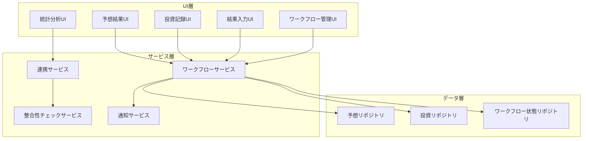
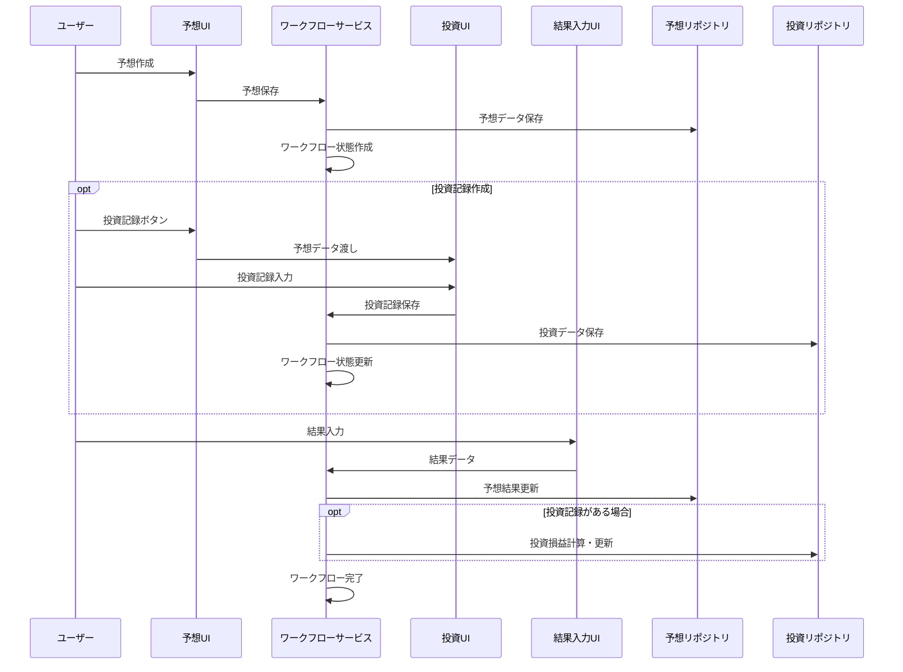

# 予想投資ワークフロー連携機能 設計書

## 概要

既存の競馬予想アプリに、予想→投資記録→結果入力の統合ワークフローを実装する。予想は必須、投資記録は任意、結果入力で両方が更新される柔軟なシステムを構築し、予想精度と投資パフォーマンスの統合分析を可能にする。

## アーキテクチャ

### システム全体構成



### データフロー



## コンポーネント設計

### 1. ワークフローサービス (WorkflowService)

予想、投資記録、結果入力の連携を管理する中核サービス。

```typescript
interface WorkflowService {
  // 予想から投資記録への連携
  createInvestmentFromPrediction(predictionId: string): Promise<InvestmentFormData>;
  
  // 結果入力による更新
  updateResultsWithWorkflow(resultData: RaceResultInput): Promise<WorkflowUpdateResult>;
  
  // ワークフロー状態管理
  getWorkflowStatus(predictionId: string): Promise<WorkflowStatus>;
  getIncompleteWorkflows(): Promise<IncompleteWorkflow[]>;
  
  // 統合統計
  getIntegratedStats(criteria: StatsCriteria): Promise<IntegratedStats>;
}

interface WorkflowStatus {
  predictionId: string;
  hasPrediction: boolean;
  hasInvestment: boolean;
  hasResult: boolean;
  isComplete: boolean;
  lastUpdated: Date;
}

interface IncompleteWorkflow {
  id: string;
  type: 'prediction-result' | 'investment-result';
  raceInfo: RaceInfo;
  daysElapsed: number;
  priority: 'high' | 'medium' | 'low';
}

interface WorkflowUpdateResult {
  predictionUpdated: boolean;
  investmentUpdated: boolean;
  accuracyCalculated: boolean;
  profitCalculated: boolean;
  errors: string[];
}
```

### 2. 連携サービス (LinkageService)

予想と投資記録の関連付けと統合分析を担当。

```typescript
interface LinkageService {
  // 関連付け管理
  linkPredictionToInvestment(predictionId: string, investmentId: string): Promise<void>;
  unlinkPredictionFromInvestment(predictionId: string, investmentId: string): Promise<void>;
  
  // 統合分析
  analyzePredictionInvestmentCorrelation(): Promise<CorrelationAnalysis>;
  getConfidenceLevelROI(): Promise<ConfidenceLevelROI[]>;
  getBetTypeAccuracy(): Promise<BetTypeAccuracy[]>;
  
  // データ整合性
  validateDataIntegrity(): Promise<IntegrityReport>;
  repairDataInconsistencies(issues: IntegrityIssue[]): Promise<RepairResult>;
}

interface CorrelationAnalysis {
  overallCorrelation: number; // -1 to 1
  confidenceLevelAnalysis: {
    level: 'high' | 'medium' | 'low';
    averageAccuracy: number;
    averageROI: number;
    sampleSize: number;
  }[];
  betTypeAnalysis: {
    betType: BetType;
    accuracy: number;
    roi: number;
    profitability: number;
  }[];
}
```

### 3. 拡張された予想結果コンポーネント

既存のPredictionResultsコンポーネントを拡張し、ワークフロー連携機能を追加。

```typescript
interface EnhancedPredictionResultsProps extends PredictionResultsProps {
  workflowStatus?: WorkflowStatus;
  onCreateInvestment?: (predictionId: string) => void;
  onEnterResult?: (predictionId: string) => void;
  showWorkflowActions?: boolean;
}

// 新しいワークフローアクションバー
interface WorkflowActionBarProps {
  predictionId: string;
  workflowStatus: WorkflowStatus;
  onCreateInvestment: () => void;
  onEnterResult: () => void;
  onViewStats: () => void;
}
```

### 4. 統合結果入力コンポーネント

予想結果と投資記録の両方を更新する結果入力フォーム。

```typescript
interface IntegratedResultInputProps {
  predictionId: string;
  raceInfo: RaceInfo;
  predictions: HorseAnalysis[];
  relatedInvestments?: Investment[];
  onSubmit: (resultData: IntegratedResultData) => Promise<void>;
  onCancel: () => void;
}

interface IntegratedResultData {
  raceResult: {
    ranking: number[];
    times?: number[];
    margins?: string[];
  };
  payoutData?: {
    [betType: string]: {
      [combination: string]: number;
    };
  };
  manualInvestmentUpdates?: {
    investmentId: string;
    payout: number;
    profit: number;
  }[];
}
```

### 5. ワークフロー管理ダッシュボード

未完了タスクの管理と進捗状況の可視化。

```typescript
interface WorkflowDashboardProps {
  incompleteWorkflows: IncompleteWorkflow[];
  recentActivity: WorkflowActivity[];
  onNavigateToTask: (workflowId: string, taskType: string) => void;
  onMarkComplete: (workflowId: string) => void;
}

interface WorkflowActivity {
  id: string;
  type: 'prediction-created' | 'investment-added' | 'result-entered';
  timestamp: Date;
  raceInfo: RaceInfo;
  details: string;
}
```

## データモデル拡張

### 1. 予想結果モデルの拡張

```typescript
interface EnhancedPredictionResult extends PredictionResult {
  // ワークフロー関連
  workflowStatus: WorkflowStatus;
  relatedInvestmentIds: string[];
  
  // 統計用
  confidenceLevel: 'high' | 'medium' | 'low';
  accuracyScore?: number; // 0-100
  
  // メタデータ
  createdBy?: string;
  tags?: string[];
  notes?: string;
}
```

### 2. 投資記録モデルの拡張

```typescript
interface EnhancedInvestment extends Investment {
  // 予想との関連付け
  predictionId?: string;
  predictionConfidence?: number;
  
  // 結果データ
  actualRanking?: number[];
  isResultConfirmed: boolean;
  resultEnteredAt?: Date;
  
  // 分析用
  expectedValue?: number;
  riskLevel?: 'low' | 'medium' | 'high';
}
```

### 3. ワークフロー状態モデル

```typescript
interface WorkflowState {
  id: string;
  predictionId: string;
  raceId: string;
  
  // 状態フラグ
  hasPrediction: boolean;
  hasInvestment: boolean;
  hasResult: boolean;
  isComplete: boolean;
  
  // タイムスタンプ
  predictionCreatedAt?: Date;
  investmentCreatedAt?: Date;
  resultEnteredAt?: Date;
  completedAt?: Date;
  
  // 関連ID
  investmentIds: string[];
  
  // 優先度とリマインダー
  priority: 'high' | 'medium' | 'low';
  reminderSent: boolean;
  lastReminderAt?: Date;
}
```

## インターフェース設計

### 1. ワークフローリポジトリ

```typescript
interface WorkflowRepository {
  // 基本CRUD
  create(workflowState: Omit<WorkflowState, 'id'>): Promise<string>;
  findById(id: string): Promise<WorkflowState | null>;
  findByPredictionId(predictionId: string): Promise<WorkflowState | null>;
  update(id: string, updates: Partial<WorkflowState>): Promise<void>;
  delete(id: string): Promise<void>;
  
  // クエリ
  getIncompleteWorkflows(): Promise<WorkflowState[]>;
  getWorkflowsByStatus(status: Partial<WorkflowStatus>): Promise<WorkflowState[]>;
  getWorkflowsByDateRange(start: Date, end: Date): Promise<WorkflowState[]>;
  
  // 統計
  getCompletionStats(): Promise<{
    total: number;
    completed: number;
    completionRate: number;
    averageCompletionTime: number;
  }>;
}
```

### 2. 統合統計サービス

```typescript
interface IntegratedStatsService {
  // 予想精度と投資成績の相関
  getAccuracyROICorrelation(period?: DateRange): Promise<{
    correlation: number;
    dataPoints: Array<{
      accuracy: number;
      roi: number;
      date: Date;
    }>;
  }>;
  
  // 確信度レベル別分析
  getConfidenceLevelAnalysis(): Promise<{
    high: { accuracy: number; roi: number; count: number };
    medium: { accuracy: number; roi: number; count: number };
    low: { accuracy: number; roi: number; count: number };
  }>;
  
  // 券種別予想精度
  getBetTypeAccuracyAnalysis(): Promise<Array<{
    betType: BetType;
    predictionAccuracy: number;
    investmentROI: number;
    recommendedStrategy: string;
  }>>;
  
  // 改善提案生成
  generateImprovementSuggestions(): Promise<Array<{
    category: 'prediction' | 'investment' | 'workflow';
    priority: 'high' | 'medium' | 'low';
    suggestion: string;
    expectedImpact: string;
    actionItems: string[];
  }>>;
}
```

## エラーハンドリング

### 1. ワークフロー固有のエラー

```typescript
enum WorkflowErrorType {
  PREDICTION_NOT_FOUND = 'PREDICTION_NOT_FOUND',
  INVESTMENT_ALREADY_EXISTS = 'INVESTMENT_ALREADY_EXISTS',
  RESULT_ALREADY_ENTERED = 'RESULT_ALREADY_ENTERED',
  DATA_INCONSISTENCY = 'DATA_INCONSISTENCY',
  WORKFLOW_STATE_INVALID = 'WORKFLOW_STATE_INVALID'
}

interface WorkflowError extends Error {
  type: WorkflowErrorType;
  predictionId?: string;
  investmentId?: string;
  details: Record<string, any>;
  recoverable: boolean;
  suggestedAction?: string;
}
```

### 2. データ整合性チェック

```typescript
interface IntegrityChecker {
  checkPredictionInvestmentLinks(): Promise<IntegrityIssue[]>;
  checkWorkflowStates(): Promise<IntegrityIssue[]>;
  checkResultConsistency(): Promise<IntegrityIssue[]>;
  
  repairOrphanedInvestments(): Promise<RepairResult>;
  repairInconsistentWorkflowStates(): Promise<RepairResult>;
  repairMissingResults(): Promise<RepairResult>;
}

interface IntegrityIssue {
  type: 'orphaned_investment' | 'missing_workflow' | 'inconsistent_result';
  severity: 'critical' | 'warning' | 'info';
  description: string;
  affectedIds: string[];
  autoRepairable: boolean;
  repairAction?: string;
}
```

## テスト戦略

### 1. ユニットテスト

- WorkflowServiceの各メソッド
- LinkageServiceの関連付けロジック
- データ整合性チェック機能
- 統計計算の正確性

### 2. 統合テスト

- 予想→投資記録→結果入力の完全フロー
- データ同期と整合性維持
- エラー発生時の復旧処理
- 通知とリマインダー機能

### 3. E2Eテスト

- ユーザージャーニー全体
- 複数のワークフローの並行実行
- データエクスポート・インポート
- パフォーマンステスト

## パフォーマンス最適化

### 1. データベース最適化

```typescript
// インデックス戦略
interface DatabaseIndexes {
  predictions: ['timestamp', 'raceId', 'isResultEntered'];
  investments: ['timestamp', 'predictionId', 'raceId'];
  workflowStates: ['predictionId', 'isComplete', 'priority'];
}

// クエリ最適化
interface OptimizedQueries {
  getIncompleteWorkflowsWithDetails(): Promise<WorkflowWithDetails[]>;
  getIntegratedStatsForPeriod(start: Date, end: Date): Promise<IntegratedStats>;
  getBulkWorkflowStatus(predictionIds: string[]): Promise<Map<string, WorkflowStatus>>;
}
```

### 2. キャッシュ戦略

```typescript
interface CacheStrategy {
  // 統計データのキャッシュ（5分間）
  integratedStats: CacheConfig<IntegratedStats>;
  
  // ワークフロー状態のキャッシュ（1分間）
  workflowStatus: CacheConfig<Map<string, WorkflowStatus>>;
  
  // 未完了タスクのキャッシュ（30秒間）
  incompleteWorkflows: CacheConfig<IncompleteWorkflow[]>;
}
```

## セキュリティ考慮事項

### 1. データアクセス制御

- ユーザー固有のワークフローデータの分離
- 投資記録の機密性保護
- 統計データの匿名化オプション

### 2. データ整合性保護

- トランザクション処理による原子性保証
- 楽観的ロックによる競合状態の回避
- バックアップ前の整合性チェック

## 移行戦略

### Phase 1: 基盤実装
1. WorkflowServiceとLinkageServiceの実装
2. データモデルの拡張
3. 基本的なワークフロー管理機能

### Phase 2: UI統合
1. 既存コンポーネントの拡張
2. ワークフロー管理ダッシュボード
3. 統合結果入力フォーム

### Phase 3: 高度な機能
1. 統合統計分析
2. 改善提案機能
3. 通知とリマインダー

### Phase 4: 最適化
1. パフォーマンス最適化
2. データ整合性チェック強化
3. エラーハンドリング改善